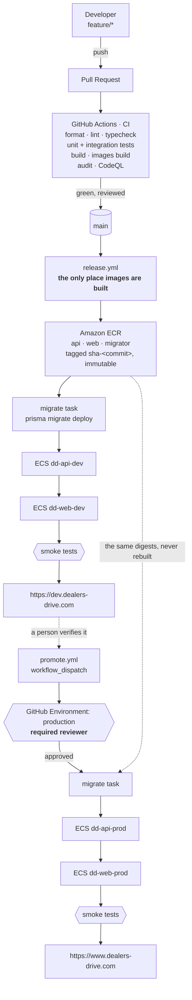

# Dealers-Drive — environments, CI/CD and deployment

Three environments, one artifact, one manual gate.

```
LOCAL                     DEVELOPMENT                    PRODUCTION
laptop                    dev.dealers-drive.com          www.dealers-drive.com
docker compose            automatic, on merge to main    manual, with approval
its own database          its own database               its own database
```

This document is the decision record and the runbook. `deploy/aws/README.md`
is the one-time infrastructure setup; `deploy/README.md` is the older
single-box deployment, which still works and is what the investor demo runs on.

**Contents** — [A. Current state](#a-current-state) · [B. Gaps](#b-what-was-in-the-way) ·
[C. Architecture](#c-recommended-architecture) · [D. Infrastructure](#d-infrastructure) ·
[E. CI/CD](#e-cicd) · [F. Configuration and secrets](#f-configuration-and-secrets) ·
[G. Repository changes](#g-repository-changes) · [H. Implementation plan](#h-implementation-plan) ·
[I. Developer workflow](#i-developer-workflow) · [J. Deployment workflow](#j-deployment-workflow) ·
[K. Rollback](#k-rollback) · [L. Cost](#l-cost)

---

## A. Current state

What the repository already had, before any of this. It is a lot, and most of
the work below was removing obstacles rather than adding machinery.

| | |
| --- | --- |
| **Shape** | pnpm + Turborepo monorepo. `apps/api` (Express 5, modular monolith), `apps/web` (Next.js 15 App Router), `packages/contracts` (Zod schemas shared by both), `packages/config` (eslint/tsconfig presets). One repository, two deployables. |
| **Database** | PostgreSQL via Prisma 6. Four migrations, a deterministic seed, `db:migrate:deploy` already separated from `migrate dev`. |
| **Jobs** | pg-boss on the same database. `WORKER_INLINE=true` runs handlers in the HTTP process. |
| **Auth** | Google OAuth 2.0 (code + PKCE + nonce) for dealers, Argon2id passwords for admins, opaque `dd_session` cookie against a `sessions` row. `SameSite=Lax`, `Secure` in production, `HttpOnly`, optional cookie domain. |
| **Storage** | One S3 adapter serving MinIO locally and R2 in production, chosen by `STORAGE_DRIVER`. Presigned direct-to-bucket uploads. |
| **Config** | `apps/api/src/config/env.ts` — Zod-validated at boot, with production cross-checks that refuse to start on a surviving local default, `AUTH_MODE=dev`, filesystem storage, or missing Google credentials. This is unusually good and everything below leans on it. |
| **Tests** | Vitest, two projects: unit (mirrors `src/`, no I/O) and integration (a real Postgres, migrated and seeded per run). 90% coverage enforced in all three packages. |
| **Docker** | Multi-stage, workspace-aware Dockerfiles for both apps, non-root, with health checks. A `migrator` stage that keeps the Prisma CLI. `docker-compose.yml` for local Postgres/MinIO/Mailpit and an optional app profile. |
| **Deployment** | One EC2 box: nginx terminating TLS, two systemd units, Postgres and MinIO in Docker, and `deploy/release.sh` — `git pull`, build **on the server**, migrate, restart. Documented honestly as demo-grade. |
| **CI** | **None.** No `.github/` directory at all. |
| **Design intent** | `docs/ARCHITECTURE.md` §20 already specified build-once/promote-many, a `sha-` tagged registry, a dev→production promotion with a GitHub Environment approval, and expand/contract migrations. None of it was implemented, and three assumptions in it turned out to be false against the code as written (§B). |

## B. What was in the way

Six things, found by running the build rather than reading it. The first two
are the reason a CI-built image could not have been promoted from dev to
production at all.

### B1 · The web image was environment-specific — build failed with no API

Four public routes and the sitemap were ISR (`export const revalidate`), so
`next build` prerendered them, and prerendering them **called the API**:

```
$ API_BASE_URL=http://127.0.0.1:4999 pnpm --filter web build
Error occurred prerendering page "/sitemap.xml"
[TypeError: fetch failed] connect ECONNREFUSED
```

That is why `deploy/release.sh` and `scripts/app-up.sh` both had to start the
API before building the web app, and why compose needed two passes. In CI it is
worse than inconvenient: whatever database the build machine could reach would
be baked into the image as HTML, and the same image could no longer mean the
same thing in two environments. Build-once/promote-many was not achievable.

### B2 · `robots.txt` would have shipped `Disallow: /` to production

`app/robots.ts` reads `APP_ENV` and disallows everything outside production. It
was statically generated, so it froze the **build machine's** value into the
image — and CI has no `APP_ENV`:

```
$ cat .next/server/app/robots.txt.body
User-Agent: *
Disallow: /
```

A build-once pipeline would have de-indexed the marketplace on its first
production deploy, permanently and silently. This is the exact failure mode the
`NEXT_PUBLIC_*` ban exists to prevent, arriving through prerendered output
instead of through a bundled variable.

### B3 · Nothing could say which build was running

`/health/ready` reported status, contracts version and appEnv, but not the
commit. Without it, "deploy the same artifact dev has been running" cannot be
verified, a deployment cannot tell new tasks from old ones, and a rollback
cannot be confirmed.

### B4 · No production database bootstrap

The only way to populate a database was `db:seed`, which **truncates every
application table** and then writes five fictional dealerships. But a
production database is not usable empty: the reference catalogue is required
(a dealer cannot list a car whose make does not exist), the credit packs drive
the billing screen, the platform config defaults drive the admin console, and
somebody has to be an admin to approve the first dealership.

### B5 · Deployment was a build on the server, over SSH

`release.sh` pulls, installs, compiles and restarts on the box. It is honest
about being demo-grade, and it is the thing to replace: the artifact is created
where it runs, there is nothing to roll back to, and every deploy has a window
where the site is down.

### B6 · The API cannot be scaled horizontally yet

`WORKER_INLINE=true` runs the job handlers inside the HTTP process, so a second
API task would run every scheduled job twice. The rate limiter is also in
process memory, so N tasks means N× the intended limits. Both are known and
recorded in `CONTEXT.md` §12.5. They cap the API at one task, which is fine at
current volume and is called out as the first thing to fix when it is not.

## C. Recommended architecture

### C1 · Deploy the two apps as two services, behind one hostname per environment

The web app is a **backend-for-frontend**, not a browser client. Every data
call happens on the Next.js server (`apps/web/src/lib/api.ts`), the browser
holds no API base URL, and the two things the browser does reach directly —
the presigned photo `PUT` and the "Continue with Google" navigation — go to the
object store and to the API's own OAuth route.

So they are **two services** (they scale differently, fail differently and are
built differently) published under **one hostname per environment**:

```
https://dev.dealers-drive.com/v1/*  /health/*  /media/*  /api/docs → api service
https://dev.dealers-drive.com/*                                    → web service
```

**Not** `api-dev.dealers-drive.com`. A separate API subdomain forces
`SESSION_COOKIE_DOMAIN=.dealers-drive.com` so the cookie is shared between
`www` and `api` — and a cookie scoped to the parent domain is also sent to
`dev.dealers-drive.com`. One environment's session would be presented to
another's API. The single-origin layout keeps every cookie host-only, which
makes cross-environment interference impossible rather than merely unlikely,
and removes CORS from the browser path entirely.

### C2 · Where it runs

**AWS ECS Fargate, in ap-south-1 (Mumbai), behind one Application Load
Balancer, with images in ECR and Postgres on RDS.** Media stays on Cloudflare
R2, which the storage adapter already supports and which charges nothing for
egress.

The alternatives, honestly compared for *this* application at *this* stage:

| | Cost/mo | Ops burden | Rollback | Fits this app? |
| --- | --- | --- | --- | --- |
| **ECS Fargate + ALB + RDS** ✅ | ~$190 | Moderate one-time setup, then near-zero | Previous task definition, automatic via circuit breaker | Yes. Runs the existing images unchanged, health-gated, zero-downtime, Mumbai region, one account for logs/metrics/secrets/IAM |
| EC2 + Docker Compose (today) | ~$35 | Low until it breaks | None — the artifact is built on the box | It works, and it is what the demo runs on. No zero-downtime, no rollback, one disk holding the database |
| AWS App Runner | ~$120 | Lowest of the AWS options | Redeploy previous image | Plausible. Fewer knobs, per-service VPC connectors for RDS, and less control over health-gated rollout |
| Fly.io | ~$70 | Low | `fly deploy --image` of an older tag | Genuinely good, and Mumbai is a region. Less mature IAM/audit story; a second vendor for secrets |
| Render | ~$85 | Lowest overall | One-click, built in | Deploys an image digest by API, which is exactly this model. **No India region** — Singapore adds ~60ms for every buyer |
| Vercel (web) + anything (api) | $20/user + api | Low for the front end | Instant, per deployment | Splits the artifact model: Vercel builds its own frontend per environment, so "promote the tested bytes" stops being true for half the system |
| Kubernetes / EKS | $73 before workloads | High | Excellent | No. Four containers do not need a control plane, and the team is small |

The deciding factors: the images already exist and ECS runs them unchanged; the
buyers are in Tamil Nadu and ap-south-1 is the closest region any of these
offer; ECS's deployment circuit breaker gives automatic rollback without
writing one; and everything — logs, metrics, secrets, database, registry, IAM —
stays in one account with one audit trail. The cost premium over Fly or Render
is real (~$100/month) and is the price of that.

**If that premium is the binding constraint, take Fly.io.** Every file in this
repository stays as it is except one job in `_deploy.yml`: build-once/promote-
many, the health gates, the smoke tests and the approval gate are all
platform-independent. That is deliberate.

### C3 · The picture



Runtime, one environment:

```
                    Cloudflare DNS (or Route 53)
                              │
                    ┌─────────▼──────────┐
   browser ─────────▶  Application Load  │  ACM certificate, 80 → 443
                    │      Balancer      │  host + path rules
                    └────┬──────────┬────┘
                         │          │
        /v1 /health /media          everything else
                         │          │
              ┌──────────▼──┐   ┌───▼─────────┐
              │ ECS dd-api  │◀──┤ ECS dd-web  │  Service Connect,
              │ Express     │   │ Next.js BFF │  http://dd-api-dev:4000
              │ + inline    │   └─────────────┘
              │   workers   │
              └──┬───────┬──┘
                 │       │
        ┌────────▼──┐  ┌─▼─────────────────┐        ┌──────────────────┐
        │ RDS       │  │ Cloudflare R2     │◀───────┤ browser, presigned
        │ Postgres  │  │ dd-media-<env>    │  PUT   │ direct upload    │
        │ private   │  └───────────────────┘        └──────────────────┘
        └───────────┘
```

## D. Infrastructure

Exactly what exists, and why. The commands are in `deploy/aws/README.md`.

| Service | What | Why this and not something else |
| --- | --- | --- |
| **ECR** ×3 | `dealers-drive/api`, `/web`, `/migrator`, immutable tags, 30-image lifecycle | Immutable tags are what make `sha-<commit>` a rollback target. The migrator is separate because the Prisma CLI is a dev dependency the runtime image does not install |
| **ECS Fargate** | 1 cluster, 4 services, 2 one-off task families | No servers to patch. Circuit breaker + rollback gives automatic rollback for free |
| **ALB** ×1 | 4 target groups, host+path rules, HTTP→HTTPS | One load balancer for both environments; ~$18/month is not worth spending twice |
| **RDS Postgres 16** ×2 | prod `db.t4g.small` (7-day PITR, deletion protection), dev `db.t4g.micro` | Two **instances**, not two databases on one: a wrong `DATABASE_URL` should not be able to reach production's disk or CPU at all |
| **SSM Parameter Store** | SecureStrings under `/dealers-drive/{dev,production}/*` | Free at this scale; Secrets Manager is $0.40/secret/month and nothing needs rotation yet |
| **Cloudflare R2** ×2 | `dd-media-dev`, `dd-media-prod`, one scoped token each | Zero egress fees on an image-heavy marketplace, and the adapter is already written and tested |
| **ACM** | one certificate: apex, `www`, `dev` | Auto-renewing, free, and the load balancer is the only thing terminating TLS |
| **CloudWatch** | log group per service per environment, Container Insights, 6 alarms → SNS | The container's stdout is already structured JSON with a `traceId` on every line |
| **IAM** | 1 execution role, 4 task roles, 1 CI role, 2 deploy roles, GitHub OIDC | No AWS access key exists in the repository or in GitHub |
| **Sentry** | one project per environment (free tier) | The SDK is not installed yet — `SENTRY_DSN` validates and does nothing. First follow-up |

**Not included, deliberately:** Kubernetes (four containers), Terraform (the
infrastructure above changes a few times a year and is 200 lines of CLI in a
runbook; revisit when a second region or a second team appears), NAT gateway
($35/month to move tasks that the security group already protects), Redis (the
rate limiter is in-process and the queue is on Postgres), CloudFront (the one
case worth it is `/media`, which is the first optimisation when image egress
becomes a line item worth reading).

## E. CI/CD

Four workflows. The split is not cosmetic: each one has a different trigger, a
different privilege level, and a different failure meaning.

| Workflow | Trigger | Credentials | Builds? | Deploys? |
| --- | --- | --- | --- | --- |
| `ci.yml` | PR, and push to `main` | **none** | images, discarded | never |
| `release.yml` | push to `main` | ECR push only | **yes — the only place** | dev, automatically |
| `_deploy.yml` | called by the two above | per-environment deploy role | **never** | the environment it is called with |
| `promote.yml` | `workflow_dispatch` + approval | via `_deploy.yml` | **never** | production |

### On a pull request

```
PR opened / updated
      │
      ├─ verify   format → lint → typecheck → test (unit + integration,
      │           against a real Postgres service) → build
      ├─ images   both Dockerfiles build from a clean checkout, with
      │           NOTHING running. This is what stops B1 coming back
      ├─ audit    pnpm audit: blocks on critical, reports high
      └─ CodeQL   security-and-quality queries
            │
      branch protection requires all four, plus a review
            │
          merge
```

Nothing is pushed and nothing is deployed. A fork can run the whole thing.

The audit gate blocks at **critical** and reports at **high** on purpose: every
current high advisory is transitive through `next` or `prisma` with no fix this
repository can apply, and a gate that is permanently red for reasons nobody can
act on is a gate that gets ignored — including the day it goes red for a reason
somebody could have acted on. Dependabot raises the upstream bumps that
actually close them.

### On merge to `main`

```
push to main
      │
   build      three images from one commit, tagged sha-<commit>, pushed to ECR
      │       GIT_SHA is the only build argument either image takes
      │
   _deploy.yml (environment: dev — no reviewer, so it does not pause)
      │
      ├─ verify the three images exist in ECR
      ├─ migrate: a one-off Fargate task from the migrator image,
      │           inside the VPC. DATABASE_URL never leaves AWS.
      │           Fails here → nothing is deployed, the running version is untouched
      ├─ deploy api → wait for service stability (ALB health-gates it)
      ├─ deploy web → wait for service stability
      └─ smoke test dev.dealers-drive.com, including that the SHA now
         serving is the SHA just deployed
```

Under 8 minutes end to end. If the new tasks never become healthy, ECS's
circuit breaker restores the previous task definition on its own and the
workflow fails.

### To production

```
Actions → "Promote to Production" → Run workflow
      │       sha: blank = whatever dev is running now
      │
   preflight (no environment, no secrets, no approval yet)
      ├─ dev must answer /health/ready
      ├─ dev must report status: ok
      └─ the SHA must be the one dev is actually running
      │
   ⏸  GitHub Environment `production` → required reviewer
      │   approve in the UI or the mobile app
      │
   _deploy.yml — the same steps, the same images, no build step
      │
   smoke test www.dealers-drive.com
```

The preflight runs *before* the approval so that an approval is never spent on
a promotion that was going to fail on a typo.

## F. Configuration and secrets

### F1 · Three layers, and what may live in each

| Layer | Holds | Where it lives |
| --- | --- | --- |
| **Build time** | `GIT_SHA`, and nothing else | Docker build argument |
| **CI** | The ARNs of three IAM roles | GitHub repository + environment secrets |
| **Runtime, non-secret** | URLs, feature flags, `APP_ENV` | ECS task definition `environment` |
| **Runtime, secret** | Database, session, OAuth, R2 | SSM SecureString → task definition `secrets` |

The rule underneath: **nothing environment-specific is ever baked into an
image.** That is why `NEXT_PUBLIC_*` is banned (it inlines at build time), why
the ISR routes had to become dynamic (they inlined *data* at build time), and
why `robots.txt` had to become runtime-resolved (it inlined a *policy*).

GitHub holds no database credential, no session secret and no OAuth secret for
any environment. Migrations run as an ECS task inside the VPC, so the one
workflow that needs `DATABASE_URL` never sees it.

### F2 · The local `.env` files

Next.js's convention (`.env.local`, `.env.development`, `.env.production`) does
not apply here, and adopting it would be a mistake. Both apps read **one
`.env` at the repository root** — `apps/api/src/config/env.ts`,
`apps/web/next.config.ts` and `apps/api/prisma.config.ts` all load it — because
two files that must agree are two files that stop agreeing.

| File | Committed? | Purpose |
| --- | --- | --- |
| `.env.example` | **yes** | Every key, with local-safe values and a comment explaining each one. `cp .env.example .env` and a fresh clone boots |
| `.env` | **never** (gitignored) | The developer's actual values — Google credentials, and anything they want to differ |
| `deploy/aws/env.dev.example` | yes | Documentation of the dev **task definition**; nothing reads it |
| `deploy/aws/env.production.example` | yes | The same for production, and the file to read to see what differs |

dotenv never overwrites a variable that is already set, so a real environment
variable always wins over the file — which is what lets the same code run from
a `.env` on a laptop and from a task definition in ECS.

**Production-like locally** is `docker compose --profile app up -d --build`:
the real production images, running the production build, with `NODE_ENV`
deliberately left at `development` so the boot-time guards (which refuse the
local session secret, filesystem storage and `AUTH_MODE=dev`) do not stop a
laptop from starting. To exercise the guards themselves, fill in a real
`.env` and flip it.

### F3 · What differs between the three

| | local | dev | production |
| --- | --- | --- | --- |
| `APP_ENV` | `local` | `dev` | `production` |
| Origin | `http://localhost:3000` | `https://dev.dealers-drive.com` | `https://www.dealers-drive.com` |
| Database | Docker Postgres | RDS `dd-postgres-dev` | RDS `dd-postgres-prod` |
| Storage | `local` / MinIO | R2 `dd-media-dev` | R2 `dd-media-prod` |
| Google client | your own, localhost URIs | dev client | production client, published consent screen |
| `SESSION_SECRET` | the published local default | its own 32 bytes | its own 32 bytes |
| Cookie `Secure` | off (`NODE_ENV≠production`) | on | on |
| Cookie domain | host-only | host-only | host-only |
| `DOCS_ENABLED` | `true` | `true` | `false` |
| Payments / mail / sms | console | console | console → real providers as each ships |
| `robots.txt` | `Disallow: /` | `Disallow: /` | `Allow: /` |
| Banner | amber "local" | amber "dev — not real data" | none |

### F4 · Authentication across environments

The requirement is that no environment's session can be presented to another,
and it is met structurally rather than by convention:

- **Host-only cookies.** `SESSION_COOKIE_DOMAIN` is empty everywhere, so
  `dd_session` set by `dev.dealers-drive.com` is never sent to
  `www.dealers-drive.com`, and `localhost` is a third, separate jar. This is
  only possible because each environment serves its API on its own single
  origin (§C1).
- **`SameSite=Lax`, not `Strict`.** The OAuth callback is a top-level
  cross-site GET from Google; `Strict` would withhold the cookie on exactly
  that navigation. Lax still refuses to attach the cookie to a cross-site POST,
  which — with a CORS allow-list naming one origin — is what protects the
  state-changing routes.
- **`Secure` follows `NODE_ENV`,** so both deployed environments require HTTPS.
  Over plain HTTP sign-in appears to succeed and the browser silently discards
  the cookie.
- **Separate OAuth clients per environment**, each with exactly one origin and
  one redirect URI. A single client with both registered would make the
  less-protected host a way in to the better-protected one.
- **Separate `SESSION_SECRET`s.** It signs the short-lived OAuth transaction
  cookie; sharing it across environments would let one environment mint a
  transaction the other accepts.
- **Sessions are opaque tokens against a `sessions` row**, not JWTs, so a
  session is revocable and cannot be replayed against a database that does not
  contain it — which is every other environment.

## G. Repository changes

Everything created or modified, and why.

### Created

| File | Environment | What it does |
| --- | --- | --- |
| `.github/workflows/ci.yml` | PRs, `main` | The four checks plus the image build and the audit. Holds no credentials |
| `.github/workflows/release.yml` | `main` → dev | The only place images are built. Pushes three `sha-` tagged images, calls `_deploy.yml` for dev |
| `.github/workflows/_deploy.yml` | dev + production | Reusable rollout: verify images → migrate → api → web → smoke. Contains no build step, by design |
| `.github/workflows/promote.yml` | production | The manual trigger, the dev-verification preflight, and the rollback path |
| `.github/workflows/codeql.yml` | PRs, weekly | SAST |
| `.github/dependabot.yml` | — | Weekly grouped npm bumps, monthly actions and base images |
| `scripts/smoke.sh` | all three | Read-only checks against a deployed pair of URLs, including "is the running build the one just deployed" |
| `apps/web/src/app/api/health/route.ts` | all three | The web app's own probe. Calls no upstream, reports `GIT_SHA` |
| `apps/web/tests/unit/app/api/health.test.ts` | — | Keeps it honest and inside the 90% gate |
| `apps/api/prisma/seed/bootstrap.ts` | dev + production | Idempotent, non-destructive: reference catalogue, credit packs, config defaults, one admin. Fixes B4 |
| `deploy/aws/README.md` | dev + production | The one-time infrastructure runbook |
| `deploy/aws/env.dev.example`, `env.production.example` | dev / production | Every runtime variable and secret, annotated |
| `deploy/aws/taskdef/{api,web,migrate}.example.json` | dev + production | Task definition templates |
| `docs/DEPLOYMENT.md` | — | This document |

### Modified

| File | Change | Why |
| --- | --- | --- |
| `apps/web/src/app/(public)/{page,cars/page,dealers/page,saved/page}.tsx` | `revalidate` → `dynamic = 'force-dynamic'` | Fixes B1. Page-level caching moves to the fetch level, which was already explicit in every call. The route renders per request; the *data* is still cached for 60–600s |
| `apps/web/src/app/sitemap.ts` | same | Same reason; the walk is served from an hour-old fetch cache |
| `apps/web/src/app/robots.ts` | added `dynamic = 'force-dynamic'` | Fixes B2 — the file is a *policy* read from `APP_ENV`, and must be resolved at request time |
| `apps/api/src/config/env.ts` | added `GIT_SHA` | Fixes B3 |
| `apps/api/src/modules/health/health.routes.ts` + `.docs.ts` | `/health/ready` reports `version` | Fixes B3. The promotion preflight and both smoke tests read it |
| `apps/api/Dockerfile` | `ARG GIT_SHA` → `ENV GIT_SHA` | Names the artifact. Configures nothing |
| `apps/web/Dockerfile` | dropped `BUILD_API_BASE_URL`; added `GIT_SHA`; health check → `/api/health` | The build no longer contacts anything. The old build argument existed only to satisfy B1 |
| `docker-compose.yml` | web builds and starts in one pass | The two-phase dance existed only because of B1 |
| `scripts/app-up.sh` | one `compose up`, then wait for both health endpoints | Same |
| `apps/api/package.json` | added `db:bootstrap` | Fixes B4 |
| `.env.example` | added `APP_ENV`, noted `GIT_SHA` | Completes the local/dev/production picture |

### Deliberately not changed

`deploy/` (the single-box EC2 deployment) still works and is what the demo
runs on. It gets simpler as a side effect — `release.sh`'s ordering constraint
is gone — but it is not deleted until the AWS environments are carrying real
traffic.

## H. Implementation plan

The application changes (steps 1–3) are done and verified in this repository.
Steps 4 onwards are infrastructure and cannot be done from a checkout.

1. ✅ **Make the web image environment-agnostic** — the four routes, the
   sitemap and `robots.ts`. Verified: `next build` completes with the API
   unreachable, and `/robots.txt` is now server-rendered.
2. ✅ **Make the running build identifiable** — `GIT_SHA` through both
   Dockerfiles, `/health/ready` and `/api/health`. Verified: an image built
   with `--build-arg GIT_SHA=…` reports it.
3. ✅ **Add the production bootstrap, the smoke test and the workflows.**
   Verified: `docker compose --profile app up -d --build` now brings the whole
   stack up in one command, and `scripts/smoke.sh` passes 14/14 against it.
4. **Stand up the AWS account** — `deploy/aws/README.md` §1–§10. Half a day.
5. **Configure GitHub** — environments, the required reviewer on `production`,
   the variables, and branch protection on `main`. §11.
6. **First dev deploy**: merge anything; `release.yml` does the rest. Then run
   `db:bootstrap` as a one-off task and walk the product end to end.
7. **First promotion**: Actions → Promote → approve. Bootstrap production.
8. **Then, in order of what unblocks the most:** install the Sentry SDK (the
   DSN is already validated and does nothing); add the CloudWatch alarms; add
   the separate worker entrypoint so the API can run more than one task; put
   CloudFront in front of `/media`.

## I. Developer workflow

```bash
git checkout -b feature/dealer-photo-requests

pnpm install
cp .env.example .env          # once; add your own Google credentials
pnpm infra:up                 # Postgres, MinIO, Mailpit in Docker
pnpm --filter @dealers-drive/api db:migrate
pnpm --filter @dealers-drive/api db:seed
pnpm dev                      # api :4000, web :3000

# the four that must pass before anything is called done
pnpm lint
pnpm typecheck
pnpm test
pnpm build

# production-like, when it matters: the real images, the production build
pnpm app:up                   # docker compose, one pass, both health-gated
./scripts/smoke.sh http://localhost:3000 http://localhost:4000

git push -u origin feature/dealer-photo-requests
gh pr create
```

Local development depends on nothing deployed. No shared database, no shared
bucket, no VPN — `pnpm infra:up` and a `.env` copied from the example is the
whole dependency list.

**Branching: trunk-based, and nothing more.** `feature/*` and `bugfix/*` off
`main`, squash-merged back. No `develop` (the dev environment *is* the
integration branch, and it is fed by `main`), no `release/*` (there is one
production and it is promoted by SHA, not by branch), no `staging` branch (dev
is that environment). For a team this size anything more is ceremony that adds
merge work without reducing risk.

**Branch protection on `main`** — nobody pushes directly:

| Required | Why |
| --- | --- |
| `CI / lint · typecheck · test · build` | The four working-agreement commands |
| `CI / images build` | Catches a route that starts prerendering data again |
| `CI / dependency audit` | Critical advisories |
| `CodeQL / analyze` | SAST |
| 1 approving review | |
| Branch up to date before merge | Two green PRs can still be red together |
| No force pushes, no deletions, include administrators | |

## J. Deployment workflow

```
merge to main
     └─▶ release.yml (automatic, ~8 min)
           build three images → push sha-<commit> → migrate dev →
           deploy api → deploy web → smoke → https://dev.dealers-drive.com

     …verify on dev: sign in, add a car with a photo, publish, enquire, approve…

     └─▶ Actions → Promote to Production → Run workflow (leave sha blank)
           preflight: dev is healthy and running that SHA
           ⏸ approval
           migrate production → deploy api → deploy web → smoke →
           https://www.dealers-drive.com     (~4 min, no build)
```

Production is never automatic. Nothing about a merge, a tag or a schedule
deploys it — only a person opening the Actions tab and a second person (or the
same one) approving the environment.

## K. Rollback

### The application: promote an older SHA

```
Actions → Promote to Production → Run workflow
   sha:             <the previous good commit>
   skip_dev_check:  true        ← required: that SHA is not what dev is running
   reason:          "credit ledger drift after 9f2c1a"
```

Approve, and roll forward to the older bytes. Two to four minutes, no build,
and the images are the exact ones that were serving before — not a rebuild of
the same source. ECR's immutable tags are what guarantee that.

### The application: do nothing

If the new tasks never pass the ALB health check, ECS's deployment circuit
breaker restores the previous task definition **by itself**, before the new
version has served a single request, because `minimumHealthyPercent=100` means
no old task is stopped until a new one is healthy. The workflow fails and says
so. This is the common case, and it needs no human.

### The database: forward, and only forward

**A Prisma migration has no `down`, and rolling one back by hand can destroy
data. This is the part to read before an incident, not during one.**

The strategy that makes the application rollback above *safe* is
expand/contract, and it is not optional:

```
EXPAND    release N     add a nullable column, a new table, an index.
                        The currently-running old code ignores it.
MIGRATE   release N     new code writes both shapes; a job backfills.
CONTRACT  release N+2   once nothing reads the old column, drop it.
```

Because every migration is backward-compatible with the previous release, the
previous image always runs against the current schema. That is the whole reason
"redeploy the old image" is a complete rollback.

The rules, in order of how expensive they are to learn the hard way:

- **A rename is two releases.** Never one.
- **Never `ALTER COLUMN … NOT NULL`** on a populated table without a default
  and a completed backfill.
- **`CREATE INDEX CONCURRENTLY`** in production, always.
- **Set `lock_timeout` and `statement_timeout`** in any migration that touches
  a large table, so a lock can never take the site down.
- **A `DROP COLUMN` or `DROP TABLE` is irreversible without a restore.** If one
  ships and turns out to be wrong, the only recovery is point-in-time restore —
  which means **losing every write since the restore point**. On a marketplace
  that is enquiries a dealer has already been called about. Restore into a
  *new* instance, extract what is needed, and reconcile by hand. Never restore
  over production because a deploy went wrong.

Dev is the rehearsal. Every migration runs there on merge and only reaches
production on promotion, so it has always executed successfully once against
real data shapes before it touches a real dealer.

### Recovery objectives

| | Target | How |
| --- | --- | --- |
| Bad release, caught by health checks | seconds | ECS circuit breaker, automatic |
| Bad release, caught by a person | < 5 min | Promote the previous SHA |
| Database corruption / bad data migration | < 1 hour, up to the last second | RDS point-in-time recovery into a new instance |
| Region loss | days | Accepted. Backups are regional; a multi-region story is not worth its cost at this stage — say so out loud rather than implying otherwise |

## L. Cost

Assumptions: an early-stage marketplace — a few hundred listings, ~5k page
views a day, ~50 GB of photos, ~200 GB of image egress a month, one
developer, ap-south-1, on-demand pricing, no savings plans.

| | Dev | Production | Shared | Notes |
| --- | ---: | ---: | ---: | --- |
| Fargate — api | $10 | $21 | | 0.25/0.5 vCPU-GB dev, 0.5/1 prod, one task each (`WORKER_INLINE`) |
| Fargate — web | $10 | $41 | | prod runs two tasks, for zero-downtime and one AZ failure |
| RDS Postgres | $17 | $32 | | `db.t4g.micro` / `db.t4g.small`, 20 GB gp3, 7-day PITR on prod |
| ALB | | | $22 | one, shared by both environments |
| Data transfer out | $1 | $20 | | mostly `/media`; this is the line CloudFront or an R2 public domain removes |
| CloudWatch | $3 | $9 | | logs + Container Insights |
| ECR | | | $2 | 30 builds × 3 images, layers shared |
| Cloudflare R2 | $1 | $2 | | 50 GB stored, **zero egress** |
| DNS | | | $0–1 | free on Cloudflare, $0.50/zone on Route 53 |
| Sentry, uptime monitoring | | | $0 | free tiers are sufficient at this volume |
| GitHub Actions | | | $0 | ~900 min/month against 2,000 free |
| **Total** | **~$42** | **~$125** | **~$27** | **≈ $195 / month** |

Local development is $0 — Docker on the developer's machine.

Where it moves:

- **Down to ~$150** by running one web task in production (accepting a restart
  blip), and scaling both dev services to zero outside working hours with a
  scheduled action. The dev database is the floor; RDS cannot be paused for
  more than seven days at a time.
- **Down to ~$70** by choosing Fly.io instead of ECS (§C2). Same pipeline, same
  images, one job in `_deploy.yml` rewritten.
- **Up**, first, at the API: it is capped at one task until the worker
  entrypoint exists, so the next step is a bigger task, not more of them. After
  that, growth is roughly linear in Fargate tasks, and the database is the
  first thing that will need a real decision (a `db.t4g.medium`, then read
  replicas for the search read model).

## Monitoring

Sized for a team that will actually look at it. Four questions, four answers:

| Question | Answer | Cost |
| --- | --- | --- |
| Is it up? | Uptime monitor polling `/health/ready` every minute on both environments — readiness, not liveness, because readiness names the failing dependency | free |
| What broke? | Sentry on 5xx only, tagged with the `traceId` that `request-context.ts` already stamps on every log line. A 422 `INSUFFICIENT_CREDITS` is not an exception | free tier |
| What happened? | CloudWatch Logs. The application already emits one structured JSON line per event with `traceId`, `userId`, `dealerId`, and redacts `authorization`, `cookie`, `set-cookie` and password fields | ~$12/mo |
| Is it getting worse? | Six CloudWatch alarms → SNS → email: ALB 5xx rate, ALB target response time p95, unhealthy target count, ECS CPU/memory, RDS CPU, RDS free storage, RDS connections | ~$1/mo |

Four product metrics are worth more than any infrastructure dashboard here, and
none of them exist yet: enquiry-notification latency (it *is* the product),
moderation queue depth and age, credit-ledger drift (`Dealer.creditBalance`
against the newest `balanceAfter` — always zero, so any non-zero value catches
a write path that bypassed `moveCredits`), and pg-boss failed-job count.
`CONTEXT.md` §12.4 has the detail. Prometheus and Grafana are not worth their
operational cost until there is someone whose job includes reading them.

## Security

What is exposed, what is not, and what enforces it.

**Publicly reachable:** the two site hostnames on 443 only, and the R2 bucket
for presigned uploads and image reads. That is the entire attack surface.

**Not reachable from the internet:** the database (private subnets, security
group allows only the ECS tasks), the container ports (the security group
allows only the load balancer), the ECS tasks' shells (no SSH, no bastion —
Session Manager, which is audited, if a shell is genuinely needed), the SSM
parameters (task role, per environment), Swagger in production
(`DOCS_ENABLED=false`).

| Layer | Control |
| --- | --- |
| Transport | TLS at the ALB with an ACM certificate; 80 redirects to 443; HSTS from helmet |
| Application | helmet, a CORS allow-list naming one origin, RFC 9457 problem responses that leak no internals, per-IP and per-dealer rate limits on the phone-reveal and enquiry paths |
| Identity | Google OIDC for dealers, Argon2id for the one admin account, opaque revocable sessions, `HttpOnly`+`Secure`+`SameSite=Lax` cookies, host-only per environment |
| Tenancy | `dealerId` as a first-class column on every dealer-owned table, `withTenant` issuing `SET LOCAL app.dealer_id`, and a repository signature convention that makes an unscoped query a type error |
| Secrets | SSM SecureStrings, per environment, read by the task's execution role. Nothing in git, nothing in a workflow file, nothing in an image |
| Supply chain | Immutable image tags, `provenance: true` attestations, `pnpm audit`, CodeQL, Dependabot, non-root containers, `--frozen-lockfile` everywhere |
| Access | GitHub OIDC — no AWS keys. Separate build and deploy roles. The production deploy role is only assumable from a job that has entered the `production` environment, which requires the approval |
| Change control | Branch protection on `main`, required reviews, required checks, and a required reviewer on production deployments |

The two known gaps, stated rather than buried: the rate limiter is in-process
(so it counts per task — correct today at one API task, and the reason a Redis
`CachePort` is on the list before horizontal scaling), and PostgreSQL row-level
security is designed but its migration is not written (layers 1, 2 and 4 of the
four-layer tenancy model are in place and tested).
