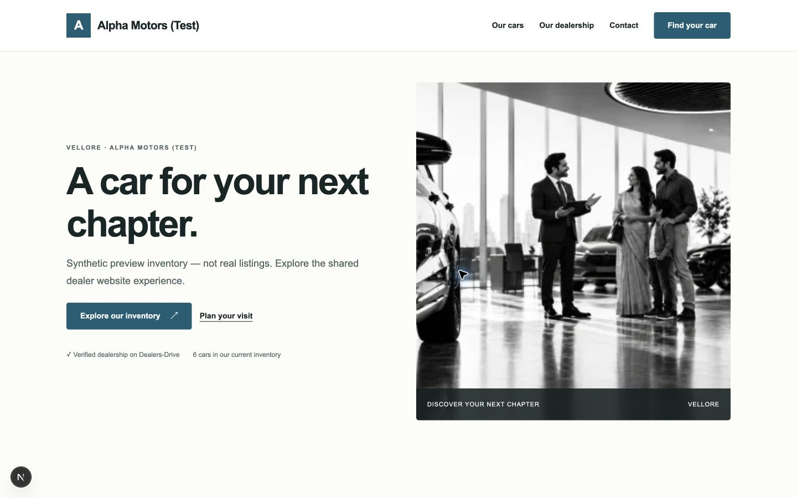

# PR #282 — shared storefront evidence

PR: https://github.com/shashikiran6sk/DealersDrive/pull/282
Head: `8815a624dea15c2163afa8f05e5c5e342546b636`.
Base: PR #281 at `2d2f487a6bf1b2cb41e59189f503cc1b647cec8f`.

Local lint/format/docs, typecheck, build and complete tests passed. API 3,061;
contracts 511; web 1,475; shared UI 17; storefront 8. API coverage 97.14% lines,
90.45% branches. All existing gates remain unchanged.

Actual running Light homepage, isolated synthetic QA database: verified no
horizontal overflow at 320, 375, 390, 768, 1024 and 1440 pixels. Measurements
and desktop screenshot are included. Images were checked loaded after layout
settled; one immediate responsive measurement caught images during a srcset
reload and is retained honestly in the JSON. The showroom asset is the existing
repository photo, labelled test presentation; inventory uses clearly labelled
synthetic UAT imagery. No real customer/KYC/credentials are included.

The browser reached the live inventory page. Further browser navigation was
blocked by automatic approval review's usage limit. Dark/mobile/detail visual
review and remaining requested screenshots are unverified; no workaround
bypassed the review. Component tests cover both themes, gallery, keyboard,
reserved cards, contact/image failure, pagination and accent contrast.

The synthetic seed script uses only `dealersdrive_white_label_qa` and temporary
storage. No production database or infrastructure changes occurred. No merges.
GitHub final-head logs/status will be added after completion. PR is OPEN,
unmerged, correctly stacked and has no auto-merge request.
