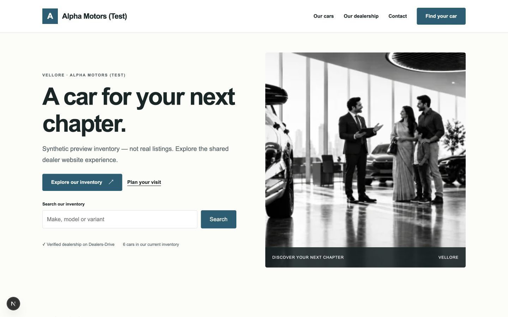
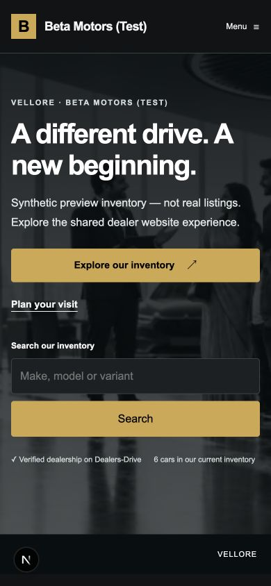

# PR #284 — final cumulative hardening evidence

PR: https://github.com/shashikiran6sk/DealersDrive/pull/284
Final head: `ef586f3e09193ba4f38840cb66e8edeba22c86d4`.
Base: PR #283 at `6e1779d2d09e86335716237f9b4e62c3e9cb7530`.
Original main baseline: `2a1845abcab9a6cf8b9fc3658cb5c92bf3c92566`.

## Executed automated checks

Text logs normalize trailing whitespace only; assertions/statuses are unchanged.

Final `pnpm lint`, `pnpm typecheck`, `pnpm test`, `pnpm build` passed. Lint includes
formatting and docs reference checks. All existing certification tests are retained.
API 3,146 tests / 164 files; web 1,482 / 123; contracts 511 / 16; shared UI 18;
storefront 12. Total: 5,169 passing tests. API coverage: 96.95% lines, 90.48%
branches, 95.88% statements, 97.54% functions. Existing 90% gates remain intact.

Real PostgreSQL/local-storage HTTP journeys cover moderation/upload/approval,
RESERVED/SOLD and stale enquiries, source/consent/inboxes/outbox, publication,
owned photos/derivatives, suspension and actual observed lock-wait revocation.
The 40-category matrix describes positive/negative/failure/concurrency/tenant
coverage and its limits. Three migration preservation rehearsals use isolated
local databases, never production. Provider/DNS/TLS adapters are deterministic
mocks at external boundaries, with exact protocol/ownership/error contracts.

Initial full-test failures (facade boundary export and derivative fixture batch
selection) were fixed without bypassing tests. Focused coverage then the full
suite passed. Added image hydration regression covers an observed early-image
failure; the final full run includes that 18th shared UI case. Earlier PR #282
Semgrep synthetic JWT findings were fixed in that PR's final head, without rule
exclusions or weakened scanners.

## Actual local browser review

Synthetic Alpha and Beta dealers have separate names, accent colors, host
mappings and Honda versus Kia stock. Local storefront hostname override selects
the registered synthetic tenant; it is ignored in production. Dealer identity
uses the repository's existing development resolver. Customer phone flow uses
its existing fake OTP driver; no SMS, live OAuth or production identity claimed.

Passed manual browser actions: Dark search to two Sonets, scoped details/related
cars, fullscreen gallery, Escape closes and returns focus; OWNER dashboard
Light→Dark save/reload/public persistence, return to Light; protected preview is
inert/noindex and uses private media BFF; synthetic example.com domain reservation
shows actual platform TXT while verification-required, safe removal retains
REMOVED tombstone; disable then explicit reactivation; customer OTP, synthetic
signup, consented enquiry, real success state and the existing dealer inbox with
"Dealer website" source. No external DNS/provider mutation or SMS occurred.

Responsive geometry: both themes' home/inventory/details, dashboard and enquiry
form have no horizontal overflow at 320/375/390/768/1024/1440px. The saved matrix
records observed widths, not requested widths alone. During local disabled-site
navigation Chrome showed ERR_BLOCKED_BY_CLIENT rather than the plain 404 body;
this visual state is not represented as a branded error page. Automated middleware
and API tests verify the real 404/noindex/no-store response; no warning bypassed.

Three final screenshots show actual implementation (development indicator),
synthetic dealerships and the repository's existing stock presentation photo.
Vehicle media is the explicitly labelled UAT fixture. No testimonials or real
customer/KYC/credential data is included. The earlier Light artifact under
PR #282 is historical and predates final homepage search.

## Performance and dependency scope

320-car synthetic tenant, 24-row pages, 12 samples: p50 18.44ms, p95 21.73ms on
local PostgreSQL/API, private/no-store, second-tenant filter gives zero results.
No production/Lighthouse/SQL statement-count/cached-SSR performance is claimed.
The full audit reports zero critical, six high and six moderate existing chain
advisories. Scope/input boundaries are discussed in the matrix and security doc;
they are not claimed eliminated. Owner review/update is a rollout prerequisite.

## External limits and final status

Real project/provider credential scope, DNS proof/routing, wildcard certificate
issuance/renewal, live TLS and production-like performance are unverified. Staging
browser workflows with real authentication/OTP and owned provider domains remain
required. Legal/privacy PR #279 reconciliation needs qualified review.

GitHub CI is pending until exact-head status/logs are added. No pending, cancelled,
skipped-required or failed check counts as passing. PR stays OPEN, unmerged with
no auto-merge. No production migration, deployment, DNS change or paid purchase.
