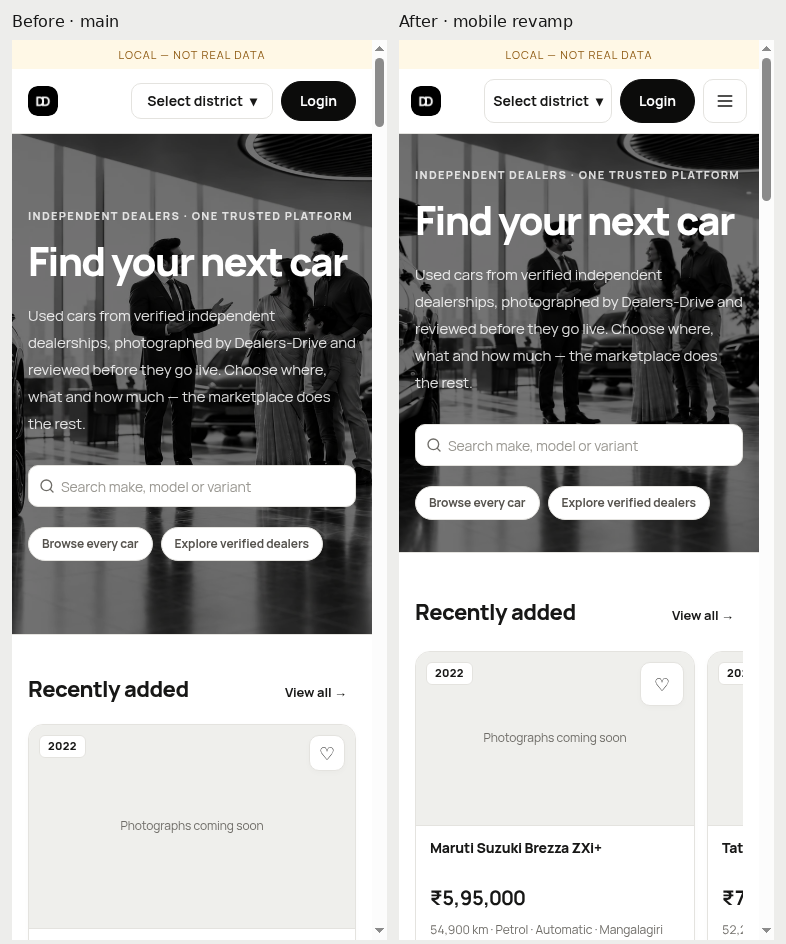
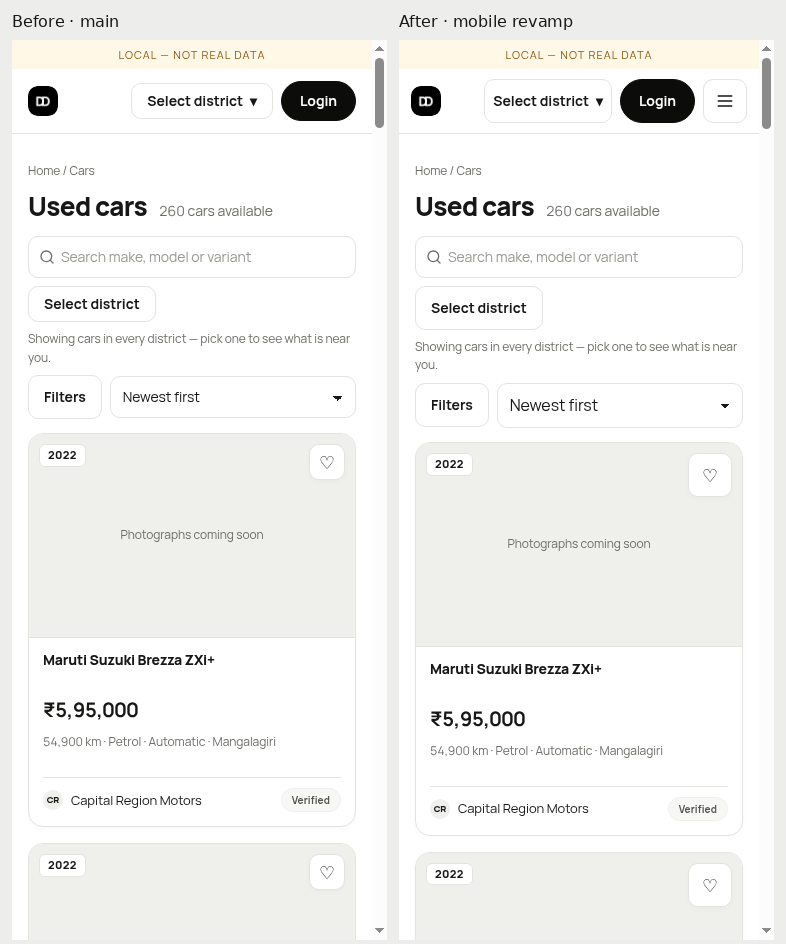
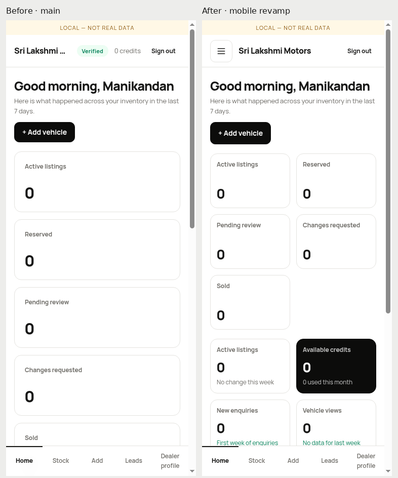
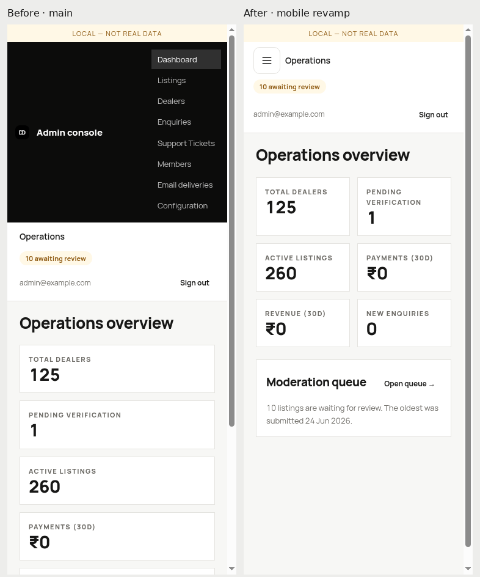
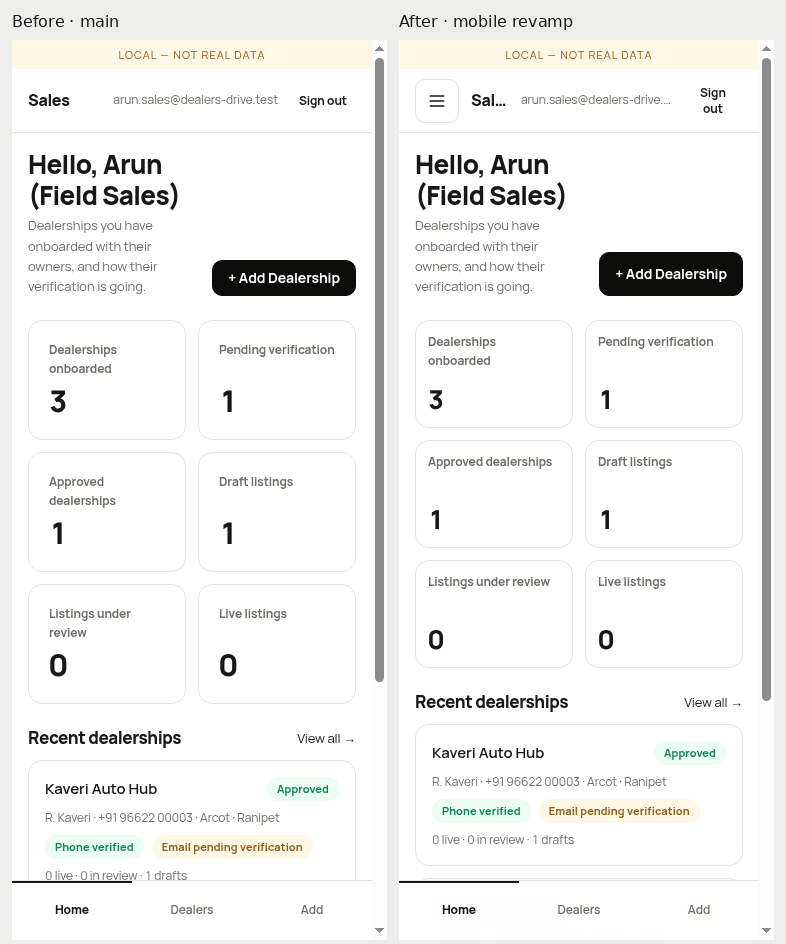
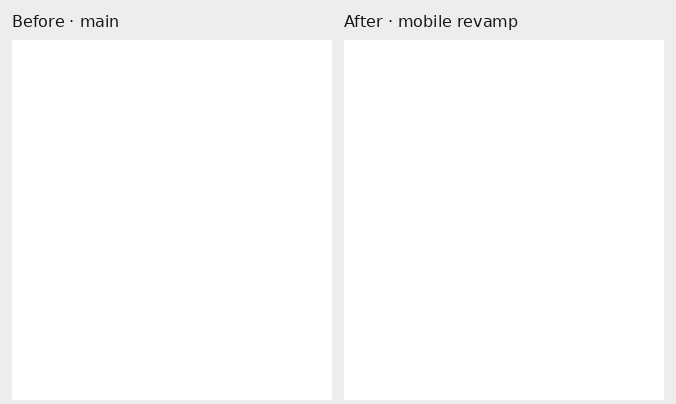
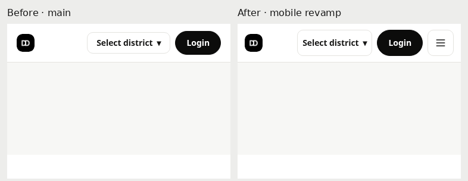

# Mobile UI revamp evidence

Implementation: [PR #285](https://github.com/shashikiran6sk/DealersDrive/pull/285), based on main `2a1845abcab9a6cf8b9fc3658cb5c92bf3c92566`. This branch contains review artifacts; it is not part of the production PR and should not be merged.

## Results

- All 4,916 repository tests passed: 1,475 web, 427 contract, 3,014 API.
- Repository lint, typecheck, and production build passed. All final GitHub checks passed; see [CI results](ci-checks.json).
- 459 component viewport checks: 51 fixtures × nine widths; no document overflow, collapsed OTP fields, wrapping OTP rows, or missing numeric input modes.
- 297 page viewport checks: 33 requested paths × nine widths. Includes expected auth redirects; 24 distinct destinations rendered. Actual sales pages use an isolated seeded sales session.
- All 66 desktop screenshot pairs at 1280px and 1440px are pixel-identical. See [desktop comparisons](desktop-comparisons.json).

Widths: 320, 360, 375, 390, 430, 768, 1024, 1280, 1440. Baselines additionally cover eight widths (all except 360).

## Representative before / after

### Home

### Cars

### Dealer Dashboard

### Admin Dashboard

### Sales Dashboard

### Otp 320

### Features

### Public Header

## Detailed artifacts

- [Component results](components-after/results.json), with every screenshot in `components-after`.
- [Page results](pages-after/results.json), including actual destination paths, text excerpts and overflow diagnostics.
- Unmodified main app screenshots in `pages-before`; deterministic fixture baselines in `components-before`.
- [Machine-readable summary](summary.json).

The baseline sandbox has only its route-aware fixture context corrected so stories can render; app source remains main. Centered/fixed-width fixture wrappers were corrected in the implementation sandbox to test realistic bounded containers.

Initial differences from blinking carets and exhausted local OTP widget request counters were recaptured after blurring fields and restarting only the isolated API. Early guest redirect screenshots were recaptured after navigation settled. None of these require changing application behavior or limits.

## Boundaries

All data comes from an isolated Postgres 16 database and existing development fixtures. No production data was modified. Development auth renders dealer/admin pages; actual sales uses a seeded cookie session. Customer OTP uses the existing fake driver, including wrong-code feedback, retry, cooldown and successful verification. This does not establish real SMS delivery or real Google OAuth. Hardware virtual keyboard and device safe-area behavior require a real device.

The responsive script is tracked in the implementation PR at `apps/web/tests/responsive/browser-check.mjs`; run it against the established Storybook sandbox and a local Chromium debugger. There is no claim that all 43 audited routes or every business mutation were exercised in a browser; source review, component fixtures, and the complete existing unit/integration suite provide the complementary coverage.

## Functional browser checks

All 33 native browser assertions passed across [the interaction reports](interactions):

- OTP typing, backspace, paste; drawer focus trapping, Escape, focus return, short viewport.
- Actual customer OTP rejection/retry/cooldown/success, account creation, a save persisting on the saved page, and an enquiry submitted to the isolated API.
- Actual unsave pressed state and persistence after reload; live search facets, clearing, sheet dismissal and URL-driven sorting at 320px.
- Gallery opening, bottom thumbnails, keyboard arrows, last-photo selection, bounded scrolling, Escape and opener focus.

These are isolated local journeys with existing fake OTP and seeded data. Full source-audit coverage and complete repository unit/integration checks complement these representative browser journeys.
